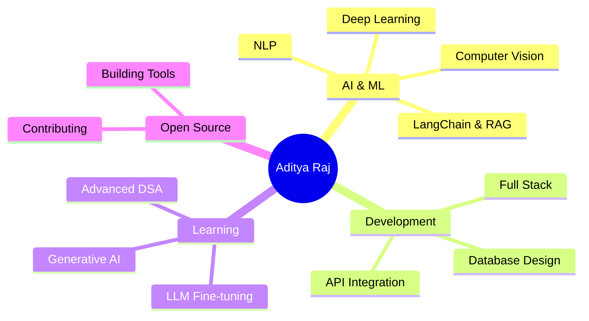

<div align="center">
  
# 👋 Namaste, I'm Aditya Raj


</div>

<div align="center">
  
[](https://www.linkedin.com/in/theadityaraj91/)
[](https://github.com/Adiraj90)
[](mailto:adikumar.rajhq91@gmail.com)
[](https://leetcode.com/u/9122908923/)

</div>

---


### 🚀 About Me

```python
class AdityaRaj:
    def __init__(self):
        self.name = "Aditya Raj"
        self.role = "AI/ML Engineer & Full Stack Developer"
        self.education = "B.Tech in CSE @ VIT Bhopal"
        self.cgpa = 8.48
        self.location = "Bihar, India 🇮🇳"
        self.interests = ["AI/ML", "Deep Learning", "NLP", "Computer Vision"]
        
    def say_hi(self):
        print("Building applications that make a real difference! 💡")

me = AdityaRaj()
me.say_hi()
```

<br>

### 🎓 Education

🎓 **Vellore Institute of Technology (VIT), Bhopal**  
📚 B.Tech in Computer Science Engineering | CGPA: **8.48/10**  
📅 2022 - 2026

---

## 🛠️ Tech Stack & Skills

<div align="center">

### 💻 Programming Languages


### 🤖 AI & Machine Learning


### 📊 Data Science & Analytics


### 🎨 Frameworks & Tools


</div>

---

## 🔥 Featured Projects

<div align="center">

### 🤖 Multi-Modal Chatbot Platform
**Tech Stack:** Python | LangChain | Streamlit | OpenAI | Ollama | RAG

✨ **Key Features:**
- 6 integrated modalities: context-aware conversations, document QA, SQL queries, web search
- RAG pipeline with PyPDFLoader & FastEmbed for 15MB+ documents
- LangChain ConversationBufferMemory for multi-turn interactions
- Real-time streaming responses with LLM switching (OpenAI/Ollama)
- 25% improvement in response accuracy through prompt engineering

---

### 📈 Stock Price Prediction Web App
**Tech Stack:** Python | LSTM | Streamlit | Tiingo/NASDAQ API

✨ **Key Features:**
- LSTM networks analyzing 3 years of historical data for 50+ stocks
- Automated data pipelines reducing manual effort by 50%
- Real-time market insights with interactive visualizations
- Accurate 30-day stock price predictions

---

### 👤 Face Recognition Attendance System
**Tech Stack:** Python | OpenCV | LBPH | Tkinter | Pandas

✨ **Key Features:**
- Real-time face recognition for 100+ students per session
- Interactive Tkinter GUI with automatic & manual attendance modes
- Live webcam streaming with audio notifications
- Automated CSV generation for attendance records

</div>

---

## 📊 GitHub Stats

<div align="center">
  


</div>

---

## 🏆 Achievements & Certifications

<div align="center">

### 🎖️ Achievements
🏅 **Prime Minister's Scholarship** - RPF Scheme (₹1.2 Lakhs) for academic excellence  
💯 **100 Days of Code** - LeetCode challenge completed (DSA focused)  
📚 **CGPA 8.48** - Academic Excellence at VIT Bhopal

### 📜 Certifications
🎓 **Complete Generative AI with LangChain & Hugging Face** - Udemy (2024)  
🎓 **MERN Stack Developer Certification** - ETHNUS (2025)

</div>

---

## 📈 Contribution Graph

<div align="center">
  
[](https://github.com/your-username)

</div>

---

## 🐍 Contribution Snake

<div align="center">
  


</div>

---

## 💼 Current Focus

<div align="center">



</div>

---

## 🎯 2025 Goals

- ✅ Complete MERN Stack Certification
- 🎯 Contribute to 10+ Open Source Projects
- 🎯 Build 5 Production-Ready AI Applications
- 🎯 Master LLM Fine-tuning & Deployment
- 🎯 Achieve 500+ LeetCode Problems Solved

---

## 📫 Let's Connect!

<div align="center">

**I'm always excited to collaborate on AI/ML projects or discuss innovative ideas!**

[](https://www.linkedin.com/in/theadityaraj91/)
[](mailto:adikumar.rajhq91@gmail.com)
[](https://github.com/Adiraj90)

</div>

---

<div align="center">

### 💭 Random Dev Quote


### 😄 Here's a Joke for You!


---


**⭐ From [Aditya Raj](https://github.com/Adiraj90) | Building the Future with AI 🚀**

</div>
